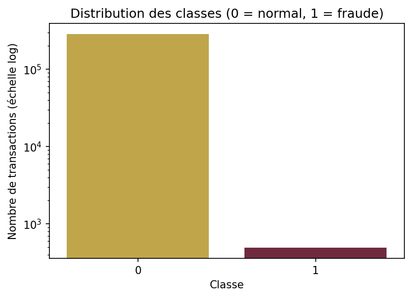
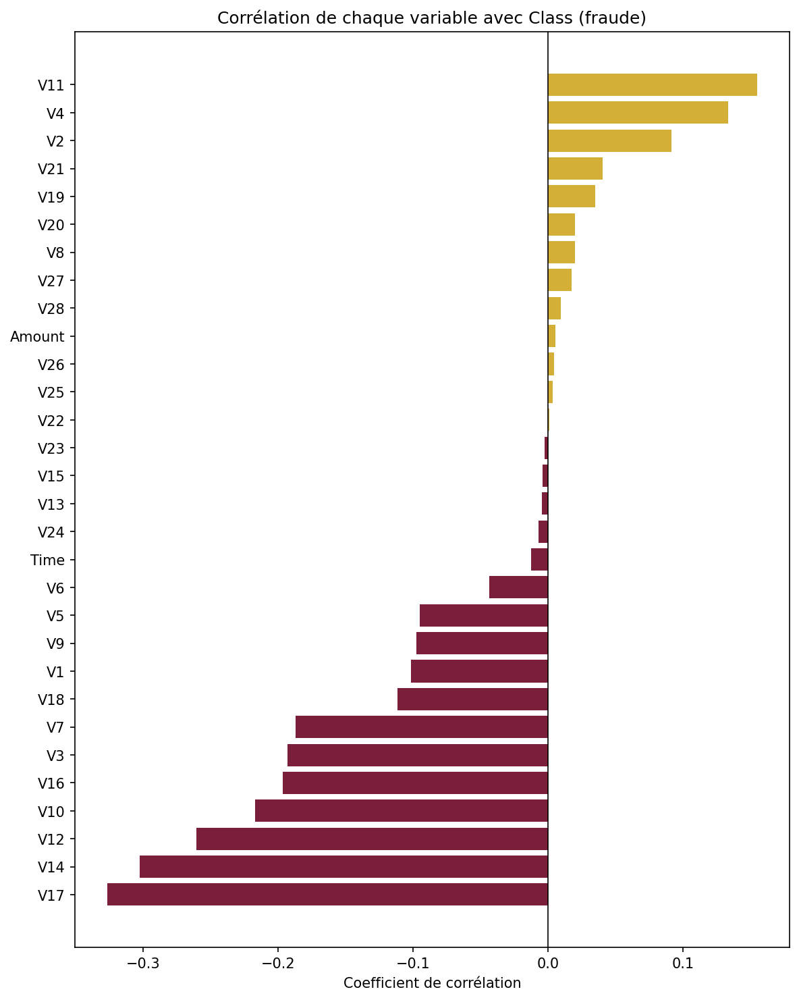
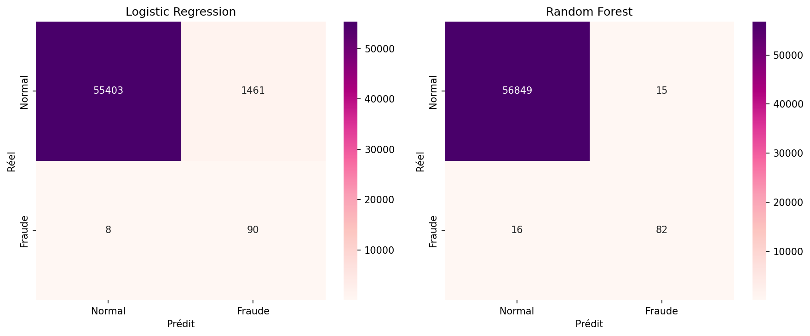
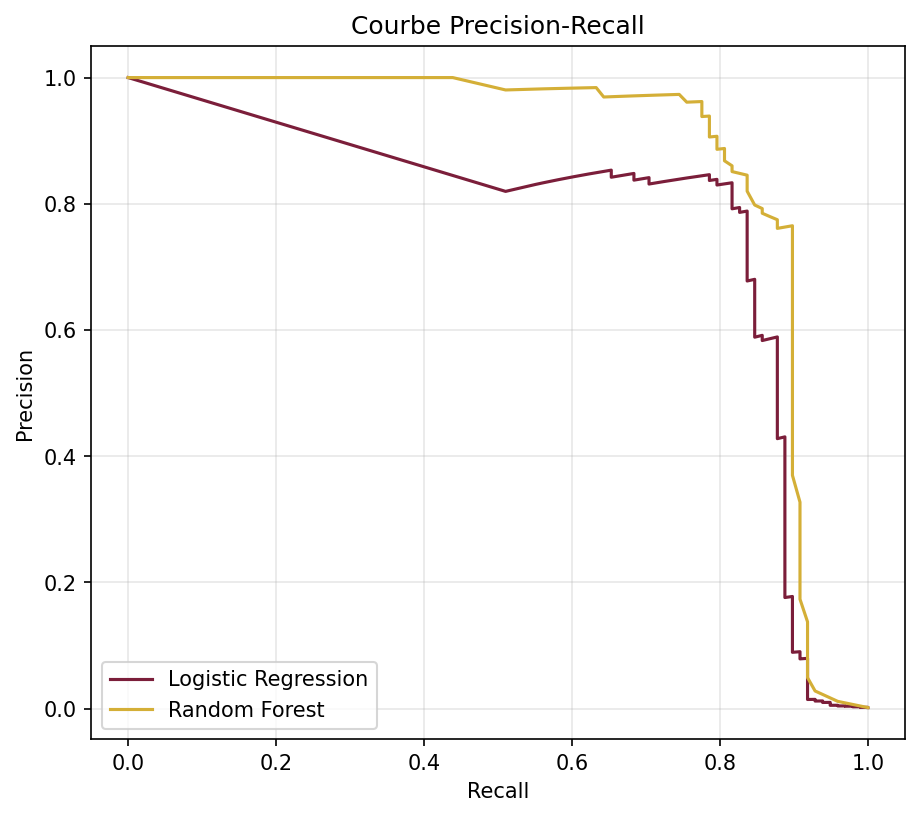

# Détection de Fraude Bancaire par Machine Learning

Système de classification pour identifier des transactions frauduleuses au sein d'un flux massivement déséquilibré, avec traitement du déséquilibre (SMOTE), comparaison de modèles et optimisation orientée métier (Recall / F1-Score).


##  Contexte & problématique

Dans un système bancaire réel, les transactions frauduleuses représentent une fraction infime du volume total — dans ce dataset, **0.173% seulement**. Un modèle naïf qui prédirait systématiquement "transaction normale" obtiendrait déjà 99.8% d'accuracy tout en étant totalement inutile.

Ce projet répond à une problématique métier concrète : **comment détecter les fraudes de manière fiable, sans être submergé de fausses alertes**, en s'appuyant sur des métriques adaptées (Recall, F1-Score) plutôt que sur l'accuracy, trompeuse dans ce contexte.

##  Dataset

- **Source** : [Credit Card Fraud Detection](https://www.kaggle.com/datasets/mlg-ulb/creditcardfraud) (Kaggle, transactions européennes, 2013)
- **Volume** : 284 807 transactions, 31 colonnes
- **Variables** : `Time`, `Amount`, `V1`–`V28` (composantes issues d'une transformation PCA, anonymisées pour raisons de confidentialité), `Class` (0 = normale, 1 = fraude)
- **Déséquilibre** : 492 fraudes pour 284 807 transactions (**0.173%**)

##  Méthodologie

### 1. Analyse exploratoire (EDA)
- Vérification de l'intégrité des données (aucune valeur manquante)
- Quantification précise du déséquilibre de classes
- Analyse de la distribution des montants par classe
- Étude de corrélation ciblée entre chaque variable et la variable cible `Class`, révélant les variables les plus discriminantes (`V17`, `V14`, `V12` en corrélation négative ; `V11`, `V4`, `V2` en corrélation positive)

<p align="center">
  
  
</p>

### 2. Prétraitement & traitement du déséquilibre
- **Split stratifié** train/test (80/20) — *avant* toute autre transformation, pour éviter toute fuite de données
- **StandardScaler** appliqué sur `Time` et `Amount` (les seules variables non normalisées), fit sur le train uniquement
- **SMOTE** (Synthetic Minority Over-sampling Technique) appliqué **uniquement sur le train** :

| | Classe 0 (normal) | Classe 1 (fraude) |

| Avant SMOTE | 227 451 | 394 |
| Après SMOTE | 227 451 | 227 451 |

### 3. Modélisation
Deux modèles de classification entraînés sur les données rééquilibrées et évalués sur le test set original (jamais touché par SMOTE) :
- **Logistic Regression** — modèle de référence, interprétable
- **Random Forest** (100 arbres) — modèle plus complexe, non-linéaire

##  Résultats

### Performances au seuil par défaut (0.5)

| Modèle | Recall (Fraude) | Precision (Fraude) | F1-Score (Fraude) |
| Logistic Regression | 0.92 | 0.06 | 0.11 |
| **Random Forest** | 0.84 | 0.85 | **0.84** |

<p align="center">
  
</p>

### Optimisation du seuil de décision (Logistic Regression)

Le seuil par défaut (0.5) s'est révélé largement sous-optimal pour un dataset aussi déséquilibré. Après recherche du seuil maximisant le F1-Score sur la courbe Precision-Recall :

| Modèle | Seuil | Recall | Precision | F1-Score |
| Logistic Regression (optimisé) | ~0.999 | 0.816 | 0.833 | **0.825** |

**Constat clé** : au seuil par défaut, la Logistic Regression semblait très inférieure au Random Forest (F1 = 0.11). Après calibration du seuil, elle devient quasiment compétitive (F1 = 0.825 vs 0.84) — la comparaison de modèles au seuil 0.5 par défaut est une erreur méthodologique classique dans ce type de problème.

<p align="center">
  
</p>

##  Conclusion métier

- Le **Random Forest** offre le meilleur compromis "out of the box" : peu de faux positifs (15) pour un bon niveau de détection (82/98 fraudes repérées).
- La **Logistic Regression correctement calibrée** reste une alternative crédible, avec l'avantage d'être **interprétable** — un critère souvent recherché dans un contexte bancaire réglementé où les décisions automatisées doivent pouvoir être expliquées.
- Le choix final dépend d'un arbitrage métier : tolérance aux faux positifs (coût opérationnel de vérification manuelle) vs tolérance aux faux négatifs (coût direct de la fraude non détectée).

##  Stack technique

`Python` · `pandas` · `scikit-learn` · `imbalanced-learn` · `matplotlib` · `seaborn`

##  Structure du repo

```
fraud-detection/
├── README.md
├── Projet_Fraude_Bancaire.ipynb
├── class_distribution.png
├── correlation_with_class.png
├── confusion_matrices.png
├── precision_recall_curve.png
└── requirements.txt
```

##  Reproduire le projet

```bash
pip install -r requirements.txt
```

Le dataset se télécharge automatiquement via l'API Kaggle (voir première cellule du notebook).


